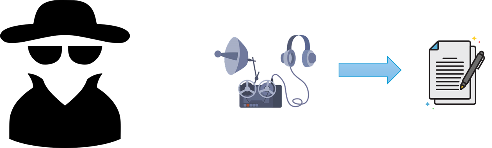
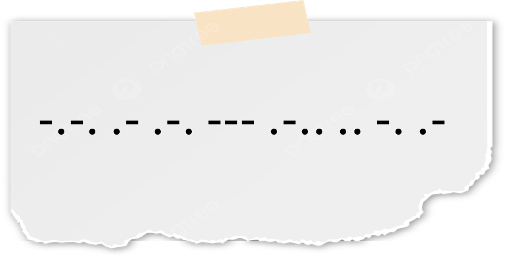

### PROJETO 01 
#### DECIFRANDO CÓDIGO MORSE

Imagine que você é um agente especial que possui a missão de interceptar mensagens secretas. Por meio da sua rede de informantes você descobre que tais mensagens estão sendo transmitidas por meio de uma frequência de rádio não utilizada em código morse.

Sua missão é:
- Interceptar estas mensagens;
- Decodificar, sabendo que as letras estão espaçadas por um espaço;
- Salvar as mensagens em um arquivo em texto claro;
- Salvar o datetime da decodificação da mensagem;

Para cumprir sua missão sem levantar suspeitas você deverá realizar a decodificação através de uma ou mais funções que :
- Recebe a mensagem como argumento;
- O "de-para morse" não deve estar hard coded;
- Path do arquivo não deve estar hard coded;
- Messagem deve ser passada através do keyboard.

