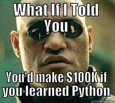

# learn-python

Repositório destinado ao ensino da linguagem python para iniciantes.

### Conteúdo
---
1. Fundamentos
2. Pandas
3. Visualização de Dados
4. Análise de Dados
5. Ingestão de dados

### Organização do repositório
---
O repositório está organizado da seguinte forma
- DESAFIOS : pequenos desafios de programação para testar suas habilidades de código e raciocínio lógico ;
- NOTEBOOKS : notebooks com exemplos dos conteúdos abordados ;
- PROJETOS : aplicação dos conteúdos abordados em pequenos projetos. 

As imagens utilizadas nos notebooks foram extraídas de: https://pythoniluminado.netlify.app
